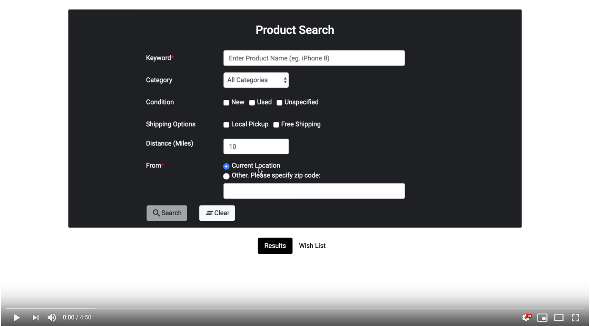

# eBaySearch

This application was built for USC's CSCI571 Web Technologies Course.

## Description

The purpose of the app is to demonstrate knowledge of Angular and basic Node.js/Express. The web application provides a form for the user to query eBay items and navigate through item results, item details, and giving an option for the user to wishlist a product they want to revisit later.

## Getting Started

### Screenshot

Click on the screenshot to visit a video of the app in action.

]

### Dependencies

There are no explicit pre-requisites for the project to run. Simply download the source code, `cd` into the root directory, and run `npm install` to install back-end dependencies. In addition, `cd` into the public folder and run `npm install` as well to install the necessary dependencies for the front-end of the project.

### Executing program

* Clone the project
* Open `sample.env`, add the proper values to the environment variables, and change filename to `.env`
* In the root directory, run `node server.js` and navigate to SERVER_PATH

## Version History

* 0.1
    * Initial Release
